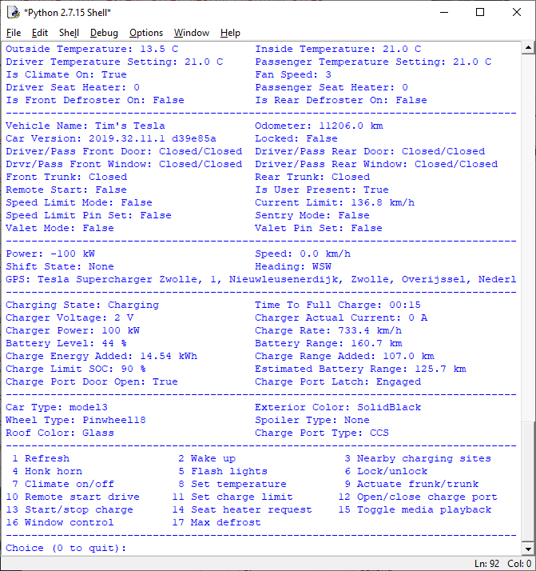

# TeslaPy

A Python implementation based on [unofficial documentation](https://tesla-api.timdorr.com/) of the client side interface to the Tesla Motors REST API, which provides functionality to monitor and control the vehicle remotely.

## Overview

The single file module *teslapy.py* depends on Python [requests](https://pypi.org/project/requests/). The `Tesla` class extends `requests.Session` and inherits methods like get and post that can be used to perform API calls. The class implements a custom OAuth 2.0 Password Grant, since *email* instead of *username* is used to authenticate users. The authentication token is cached to disk for reuse and is refreshed automatically when needed. The class provides the convenience method `api` to use named endpoints listed in *endpoints.json*, so the class does not require changes if the API is updated. The `Vehicle` class extends `dict` and is used to request and store vehicle data returned by the API. Additionally, the class implements methods to perform API calls to named endpoints, to wake up the vehicle, to list known option codes and to check if mobile access is enabled.

Basic usage of the module:

```python
import teslapy
with teslapy.Tesla(EMAIL, PASSWORD, CLIENT_ID, CLIENT_SECRET) as tesla:
	tesla.fetch_token()
	vehicles = tesla.vehicle_list()
	vehicles[0].sync_wake_up()
	vehicles[0].api('HONK_HORN')
```

Credentials are required to use the Tesla Motors API. Only `vehicle_list()` and `option_code_list()` are available if a vehicle is asleep or offline. *cli.py* is a basic implementation of a CLI application that can use almost all functionality of the TeslaPy module. If there is more than one vehicle associated to your acoount, the filter option allows you to select a vehicle:

```
usage: cli.py [-h] -e EMAIL [-p PASSWORD] [-f FILTER] [-a API] [-k KEYVALUE]
              [-l] [-o] [-w] [-g] [-n] [-m] [-d]

Tesla API CLI

optional arguments:
  -h, --help    show this help message and exit
  -e EMAIL      login email
  -p PASSWORD   login password
  -f FILTER     filter on id, vin, etc.
  -a API        API call endpoint name
  -k KEYVALUE   API parameter (key=value)
  -l, --list    list all selected vehicles
  -o, --option  list vehicle option codes
  -w, --wake    wake up selected vehicle(s)
  -g, --get     get rollup of all vehicle data
  -n, --nearby  list nearby charging sites
  -m, --mobile  get mobile enabled state
  -d, --debug   set logging level to debug
```

*menu.py* is a menu-based console application that displays vehicle data in a tabular format and converts miles into kilometers. The application depends on [geopy](https://pypi.org/project/geopy/) to convert GPS coordinates to a human readable address:



*gui.py* is a graphical interface using `tkinter`. It also supports auto refreshing of the vehicle data. The GUI displays a composed vehicle image and the application depends on [pillow](https://pypi.org/project/Pillow/), if the Tcl/Tk GUI toolkit version of your Python installation is 8.5. Python 3.4+ should include Tcl/Tk 8.6.


## Installation

Install [requests](https://pypi.org/project/requests/) and [geopy](https://pypi.org/project/geopy/) using [PIP](https://pypi.org/project/pip/):

`pip install requests geopy`

or on Ubuntu as follows:

`sudo apt-get install python-requests python-geopy`

Put *teslapy.py*, *menu.py*, *gui.py*, *endpoints.json* and *option_codes.json* in a directory and run *menu.py* or *gui.py*.

Python 2.7+ and 3.4+ are supported.